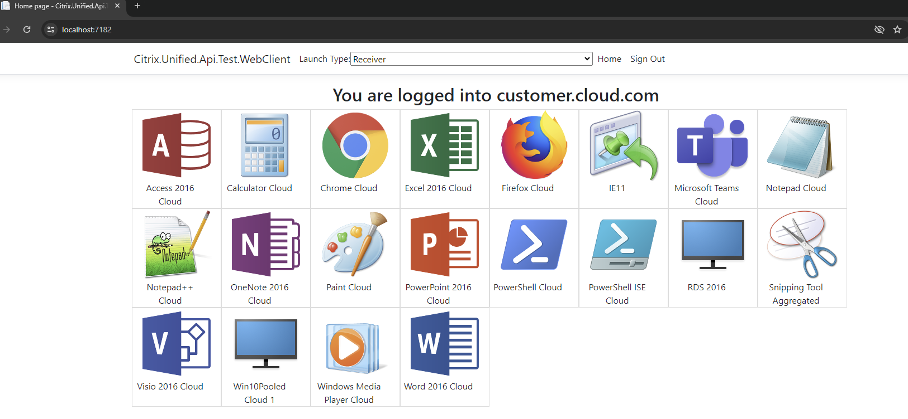
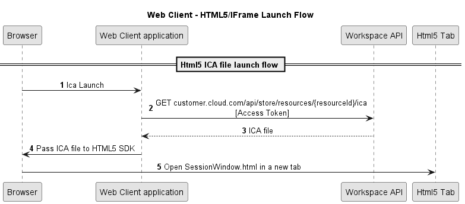

# Citrix(R) Unified Workspace API - Web Client sample built with .Net Core

This sample is a small web application, built on .NET Core, that shows how to interact with the Citrix(R) Unified Workspace APIs. This is intended to demonstrate the APIs if you would like to use some of this functionality into your own applications/web sites.

The application is a web-based client that allows the user to login via the Citrix Authorization server (and your configured Identity Provider), obtain an OAuth Access and Refresh Token, and call the Workspace APIs.

This is purely an example and shouldn't be used for real production services. The entire end-to-end flow is contained within a single application including storing the Client details.

## Sample site preview



## Prerequisites

- You have either a Private or Public Workspace OAuth Client
- You will be running the example code in Visual Studio and can run [.NET 7.0](https://dotnet.microsoft.com/en-us/download/dotnet/7.0)
- You have the [Citrix Workspace App](https://www.citrix.com/downloads/workspace-app/windows/workspace-app-for-windows-latest.html) installed

## Getting Started

### Https Self-Signed Certificate

You need to have an have a local self-signed developer certificate created and trusted. If you are using Visual Studio this should be taken care for you. See the `dotnet dev-certs` command, https://learn.microsoft.com/en-us/dotnet/core/additional-tools/self-signed-certificates-guide.

### Configuration

For this to work out of the box, your Workspace OAuth Client will need to have `https://localhost:7182/callback` added as an allowed redirect URL.

#### Workspace OAuth Client Settings

To configure the Workspace OAuth Client settings - including secrets - use the dotnet user secrets feature. See https://learn.microsoft.com/en-us/aspnet/core/security/app-secrets?view=aspnetcore-6.0&tabs=windows.

These settings will be related to OAuth clients created in the Citrix Cloud Admin Console - see [the documentation](https://developer-docs.citrix.com/en-us/workspace-platform/unified-workspace-api-preview/oauth-client-management) for details on how to create one.

Example:
```json
{
  "Client": {
    "ClientId": "clientId==",
    "ClientSecret": null,
    "ApplicationId": null,
    "CallbackPath": "/callback",
    "UsePkce": true,
    "UseOfflineAccess": true
  }
}
```

- [Required] `ClientId`: The Client ID of the client. 
- [Required] `ApplicationId`: The Application ID of the client.
- [Optional] `ClientSecret`: The Client Secret of the client, shown after creating a private client. This is only needed if a private client was created.
- [Optional] `CallbackPath`: Set to `/callback` by default, this is used to formulate the 'redirect url' that is required to be set on the client, e.g. the host for this application is `https://localhost:7182` and therefore the allowed redirect URL set on the client must be `https://localhost:7182/callback`.
- [Optional] `UsePkce`: Set to true by default, this must match what you set during client creation. You can check the value by clicking the "Edit" dropdown item for the client you want to use
- [Optional] `UseOfflineAccess`: Set to true by default, this must match what you set during client creation. You can check the value by clicking the "Edit" dropdown item for the client you want to use

## Running the example

- Recommend using an Incognito browser to avoid cookie and cache causing problems.

Once started, you should be directed to the login page:


At this point, enter your customer.cloud.com address and hit 'login'.

It should direct you to the standard login flow and after entering your login details it will take you to the home page:


Clicking on the resources should initiate a launch:


You can view the Token information by going to the `/RefreshToken` endpoint:


## Resource launches

This example supports three types of launch, native, HTML5, and IFrame.

You can switch between the launch types using the dropdown:


### Native (Receiver) launches

Native launches work by calling the native receiver with a launch ticket that can obtained from the `launchstatus` endpoint on a resource. This response contains the URL to redirect the user to.

### HTML5 and IFrame launches

HTML5 and IFrame launches work similarly to each other. These launch methods make use of the Citrix HTML5 HDX SDK. This SDK uses the ICA file which contains information about how a connection should be established. An ICA file can be obtained from the `launchica` endpoint on a resource.



Source code to launch a resource in a new tab. For more information check the [SDK documentation](https://developer-docs.citrix.com/en-us/citrix-workspace-app-for-html5/workspace-app-html5-hdx-sdx/hdx-sdk-html5)

```js
citrix.receiver.setPath("https://localhost:7182/receiver"); 
let icaFile = await apiHandler.get(launchUrl)
const sessionId = "html5"
const connectionParams = {
    "launchType": "newtab",
    "container": {
        "type": "window"
    }
};

function sessionCreated(sessionObject){
    const launchData = {"type": "ini", value: icaFile.data};
    sessionObject.start(launchData);
}
citrix.receiver.createSession(sessionId, connectionParams,sessionCreated);
```

## What could go wrong

If you are presented with this page:


it's likely that you've mis-configured your client. Please confirm the redirect URLs setup for the client and ensure it includes `https://localhost:7182/callback`, or something else if you've modified the launch settings.

If that doesn't seem to be the issue, please contact Support.

## Javascript Libraries

The repo includes the following javascript libraries,

- Bootstrap, https://getbootstrap.com/
- jQuery,  https://jquery.com/

## License

Copyright © 2025. Cloud Software Group, Inc. All Rights Reserved.
